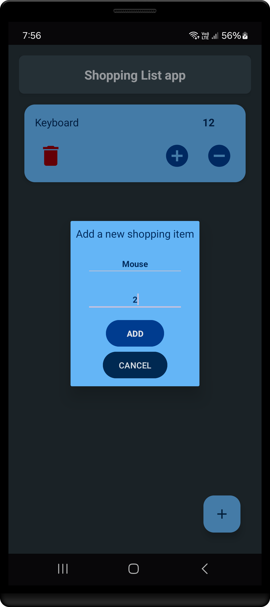

# android shopping list - beginner level sample app

This is a sample Android application for managing a shopping list. 

- **MVVM Architecture**
- **Room Database**
- **Hilt for Dependency Injection**
- **RecyclerView with Adapter**
- **View Binding**
- **Edge-to-Edge Display**

## Branches

This repository contains two versions of the code:

1. **Detailed Version (with Comments)**  
   If you need a version with detailed explanations, comments, and annotations, check out the [`app-detailed-version-with-comments`](https://github.com/NovaLogics/android-shopping-list-sample/tree/app-detailed-version-with-comments) branch.  
   This branch is ideal for learning and understanding the implementation details.

2. **Clean Version (Minimal)**  
   If you prefer a clean and minimal version of the code without comments, check out the [`main`](https://github.com/NovaLogics/android-shopping-list-sample/tree/main) branch.  
   This branch is optimized for production-ready code.

